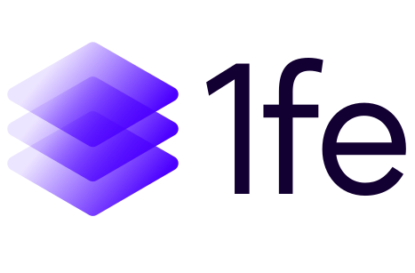

# @1fe/cli

[](https://www.npmjs.com/package/@1fe/cli) [](https://www.npmjs.com/package/@1fe/cli) [](https://github.com/docusign/1fe/actions) [](https://bundlephobia.com/result?p=@1fe/cli) [](https://opensource.org/licenses/MIT) [](https://www.typescriptlang.org/) [](https://1fe.com)

Command-line tools for building, developing, and validating widgets within the 1fe ecosystem.

To learn more about what cli has to offer, read through the reference [here](https://1fe.com/reference/1fe-config-reference/)

## Installation

```bash
npm install -g @1fe/cli
# or
yarn global add @1fe/cli
```

## What is @1fe/cli?

The `@1fe/cli` package provides essential development tools for 1fe widgets:

- **Development server** with hot reloading
- **Production builds** optimized for deployment
- **Widget validation** and contract checking
- **Bundle analysis** and optimization

## Quick Start

### Development

```bash
# Start development server
1fe-cli dev
```

### Building

```bash
# Build for production
1fe-cli build
```

## Related Packages

- **[@1fe/shell](https://www.npmjs.com/package/@1fe/shell)** - Application shell and platform utilities
- **[@1fe/server](https://www.npmjs.com/package/@1fe/server)** - Express server for 1fe instances

## Community

If you have questions or want to discuss this project, please visit the [Issues](https://github.com/docusign/1fe/issues) or [Discussions](https://github.com/docusign/1fe/discussions) pages in our monorepo.

## License

MIT © Docusign Inc.
