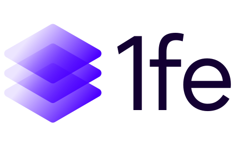

# @1fe/create-1fe-app

[](https://www.npmjs.com/package/@1fe/create-1fe-app) [](https://www.npmjs.com/package/@1fe/create-1fe-app) [](https://github.com/docusign/1fe/actions) [](https://bundlephobia.com/result?p=@1fe/create-1fe-app) [](https://opensource.org/licenses/MIT) [](https://nodejs.org/) [](https://1fe.com)

> 🚀 CLI tool to quickly scaffold a new 1fe instance

A command-line interface for creating new 1fe (One Frontend) instance

## 📋 Table of Contents

- [Requirements](#requirements)
- [Installation](#installation)
- [Usage](#usage)
- [Next Steps](#next-steps)
- [Troubleshooting](#troubleshooting)
- [Development](#development)

## 🔧 Requirements

- **Node.js 22 or higher** (enforced at runtime)
- **yarn** package manager

## 📦 Installation

### Using npx (Recommended)

```bash
# Create a new 1fe app without installing globally
npx @1fe/create-1fe-app my-awesome-app
```

### Using npm (Global Installation)

```bash
# Install globally
npm install -g @1fe/create-1fe-app

# Create a new app
create-1fe-app my-awesome-app
```

### Using yarn (Global Installation)

```bash
# Install globally
yarn global add @1fe/create-1fe-app

# Create a new app
create-1fe-app my-awesome-app
```

## 🚀 Usage

### Basic Usage

```bash
create-1fe-app <app-name>
```

### Example

```bash
# Create a new app called "my-1fe-app"
create-1fe-app my-1fe-app
```

This will:

1. ✅ **Verify Node.js version** (must be 22+)
2. 🔗 **Clone the latest 1fe starter template**
3. 📁 **Create a new directory** with your app name
4. 🧹 **Remove git history** to start fresh

## 🎯 Next Steps

After creating your app, follow these steps:

1. **Navigate to your app directory:**

   ```bash
   cd my-app
   ```

2. **Install dependencies:**

   ```bash
   yarn
   ```

3. **Start the development server:**

   ```bash
   yarn dev
   ```

4. **Open your browser:**

   ```
   http://localhost:3001
   ```

5. **Start building your app!** 🎉

## 🔍 Troubleshooting

### Node Version Error

```
🛑 Node.js version error!
Current version: v18.16.0
Minimum required version: 22.x.x
```

**Solution:** Update to Node.js 22 or higher:

```bash
# Using nvm (recommended)
nvm install 22
nvm use 22

# Or download from https://nodejs.org/
```

## 🔗 Related

- **[1fe Documentation](https://1fe.com)** - Complete 1fe framework docs
- **[Starter Template](https://github.com/docusign/1fe-starter-app)** - The template this tool clones

## 🤝 Community

If you have questions or want to discuss this project, please visit the [Issues](https://github.com/docusign/1fe/issues) or [Discussions](https://github.com/docusign/1fe/discussions) pages in our monorepo.

---

Made with ❤️ by the 1fe team
